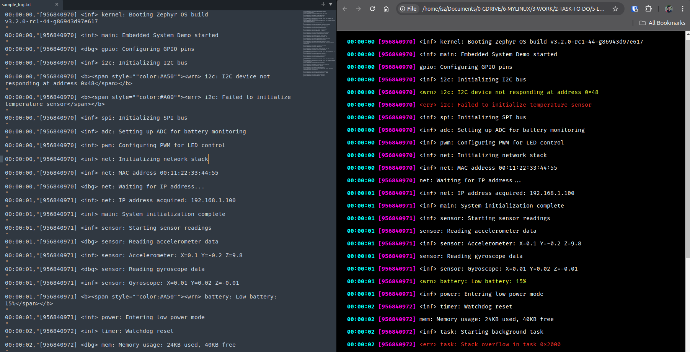

# LogHue: Interactive Colorized Log Viewer

A simple Python tool to transform plain text logs into an interactive, color-coded HTML view for easier debugging and review.

## About LogHue

LogHue was born out of the need to review saved logs more effectively. When working with embedded systems or any software that generates text-based logs, reviewing these logs later can be challenging. Plain text files lack the color-coding and interactivity that make real-time console outputs so much easier to read.



What LogHue offers:
- Conversion of plain text log files into interactive HTML format
- Color-coding for different log levels (e.g., error, warning, info)
- A simple GUI for selecting the log file to process
- Automatic opening of the generated HTML file in your default web browser

This tool aims to help:
- Developers reviewing saved log files for debugging
- Anyone who needs to analyze log files more efficiently
- Teams who share log files and want a more readable format

## Setup

### Requirements

- Python 3.0 or newer
- tkinter (usually included with Python)
- A system that supports xdg-open (primarily Linux-based systems)

### Installation

1. Clone this repository:
   ```
   git clone https://github.com/iskandarputra/LogHue-Colorized_Log_Viewer.git
   ```
2. Navigate to the project folder:
   ```
   cd loghue
   ```

No additional setup is needed as the script uses standard Python libraries.

## How to Use

1. Run the script (use sudo if necessary for accessing certain log files):
   ```
   sudo python3 loghue.py
   ```
2. Use the file selection window to choose your saved log file.
3. The script will create an HTML file named `log_viewer.html` in the same directory.
4. It will attempt to open this file in your default web browser.

If the file doesn't open automatically, you can manually open `log_viewer.html` in any web browser.

## Customization

You can adjust the appearance of the generated HTML by modifying the CSS in the `generate_html()` function. Feel free to change colors or styles to match your preferences or your organization's log format.
